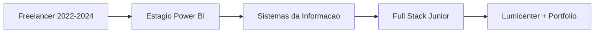
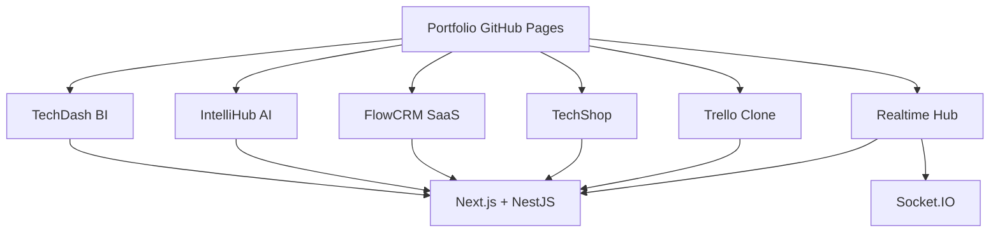
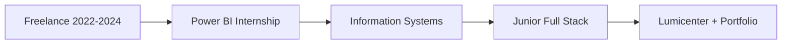

<div align="center">

<!-- BANNER ANIMADO (capsule-render) -->


<!-- TYPING SVG -->
[](https://git.io/typing-svg)

<br/>

**[🇧🇷 Português](#-português)** · **[🇺🇸 English](#-english)** · **[🎮 Mini-game](#-mini-game--caça-ao-commit)**

<br/>

<!-- BADGES DE CONTATO -->
[](mailto:brayansilver.teen@gmail.com)
[](https://www.linkedin.com/in/brayan-r-silveira-b80636150/)
[](https://brayansilver.github.io)
[](https://github.com/BrayanSilver)

<!-- BADGES DE STATUS -->


</div>

---

# 🇧🇷 Português

## 👨‍💻 Sobre mim

- **Full Stack Web Developer** construindo sites corporativos, e-commerce, sistemas internos e APIs REST
- Atualmente na **Grupo Lumicenter Lighting** — plataformas web, integrações e produtos digitais
- Graduado em **Análise e Desenvolvimento de Sistemas (CST)** — Centro Universitário Santa Cruz de Curitiba
- Pós-graduando em **Gestão de TI** *(em andamento)*
- MBA em **Inteligência Artificial** *(a iniciar)*
- Baseado em **São José dos Pinhais, PR — Brasil**
- 2+ anos de experiência freelancer antes de ingressar na Lumicenter

---

## 🛠️ Skills

**Frontend**


**Backend**


**Mobile** *(aprendizado & side projects)*


**Databases**


**Tools & other**


---

## 🔄 Fluxos

### Trajetória



### Mapa dos projetos full-stack



---

## 🎮 Mini-game — Caça ao Commit

> No README do GitHub **não roda JavaScript**.  
> Por isso cada porta é um `<details>`: **clique na opção** para abrir o resultado na hora.

### Nível 1 — O bug sumiu em produção. Onde você olha primeiro?

<details>
<summary>🚪 A — Reescrever tudo em PHP</summary>
<br/>

❌ Deploy cancelado. O time de React abriu um issue contra você. Tente outra porta.

</details>

<details>
<summary>🚪 B — Logs + último deploy</summary>
<br/>

✅ **Acertou!** Achou o `undefined` em 12 segundos. **+10 XP**  
Continue no **Nível 2** abaixo.

</details>

<details>
<summary>🚪 C — Apagar o banco “só pra ver”</summary>
<br/>

❌ Restauração de backup + retrospectiva obrigatória. Não foi dessa vez.

</details>

### Nível 2 — Qual stack alimenta o TechShop?

<details>
<summary>1️⃣ WordPress + Elementor</summary>
<br/>

❌ Bonito para landing, mas o TechShop é full-stack com API.

</details>

<details>
<summary>2️⃣ Next.js + NestJS + JWT</summary>
<br/>

✅ **Acertou!** Veja o [E-COMMERCE](https://github.com/BrayanSilver/E-COMMERCE). **+20 XP**  
Vá para o **Nível final** abaixo.

</details>

<details>
<summary>3️⃣ Só HTML estático</summary>
<br/>

❌ O carrinho JWT não ia curtir.

</details>

### Nível final — Realtime Hub: o que conecta as salas?

<details>
<summary>GraphQL</summary>
<br/>

❌ Poderoso, mas aqui o realtime é WebSocket.

</details>

<details>
<summary>⚡ Socket.IO</summary>
<br/>

✅🎉 **DEPLOY GREEN — VOCÊ VENCEU**

```
╔══════════════════════════════╗
║   Full Stack Hunter · 100 XP ║
╚══════════════════════════════╝
```

Curtiu? Explore os projetos abaixo ou feche as portas e jogue de novo.

</details>

<details>
<summary>Cron job a cada 1s</summary>
<br/>

❌ Polling não é chat em tempo real.

</details>

---

## 📊 GitHub Stats

<div align="center">
  
  
</div>

<div align="center">
  
</div>

<div align="center">
  
</div>

### 🐍 Snake nas contribuições

<div align="center">
  <picture>
    <source media="(prefers-color-scheme: dark)" srcset="https://raw.githubusercontent.com/BrayanSilver/BrayanSilver/output/github-snake-dark.svg" />
    <source media="(prefers-color-scheme: light)" srcset="https://raw.githubusercontent.com/BrayanSilver/BrayanSilver/output/github-snake.svg" />
    
  </picture>
</div>

<details>
<summary><b>📈 Gráfico de contribuições (clique para expandir)</b></summary>
<br/>
<div align="center">
  
</div>
</details>

---

## 🚀 Projetos

### Portfólio ao vivo

**[brayansilver.github.io](https://brayansilver.github.io)** · [Repositório](https://github.com/BrayanSilver/brayansilver.github.io)  
Portfólio pessoal com arquitetura MVC (ES Modules), conteúdo orientado a JSON, painel admin, projetos em destaque e carrosséis por categoria. Deploy no GitHub Pages.

---

### Projetos full-stack em destaque *(React · Next.js · NestJS)*

| Projeto | Repositório | Destaques |
|---------|------------|------------|
| **TechDash — BI Dashboard** | [PROFESSIONAL_DASHBOARD](https://github.com/BrayanSilver/PROFESSIONAL_DASHBOARD) | KPIs executivos, Recharts, monitoramento financeiro & de APIs, dados públicos ao vivo |
| **IntelliHub AI — Hub de IA** | [AI_PROJECT](https://github.com/BrayanSilver/AI_PROJECT) | Chatbot, RAG, OCR, busca semântica, geração de conteúdo (pronto para mock com OpenAI) |
| **FlowCRM — Mini CRM SaaS** | [SAAS](https://github.com/BrayanSilver/SAAS) | CRM multi-tenant, Kanban de negociações, quadro de tarefas, dashboards |
| **TechShop — E-commerce** | [E-COMMERCE](https://github.com/BrayanSilver/E-COMMERCE) | Catálogo, autenticação JWT, carrinho, checkout simulado, painel admin |
| **Trello Clone — Kanban** | [TRELLO_KANBAN](https://github.com/BrayanSilver/TRELLO_KANBAN) | Quadros, drag-and-drop, labels, checklists |
| **Realtime Hub — WebSocket** | [WEBSOCKET_INSTANT](https://github.com/BrayanSilver/WEBSOCKET_INSTANT) | Chat multi-sala, editor colaborativo, Socket.IO |
| **Slipper World Store** | [Slipper-World-Store](https://github.com/BrayanSilver/Slipper-World-Store) | [Demo ao vivo](https://slipper-world-store.vercel.app) — vitrine e-commerce |

> Screenshots de cada projeto estão na pasta `fotosProjeto/` de cada repositório.

---

### Produção & trabalhos para clientes

- **[Lumicenter E-commerce](https://lojaonline.lumicenter.com/)** — Loja oficial de iluminação LED (catálogo, checkout, integrações)
- **[Lumisoft](https://lumisoft.lumicenter.com/)** — Sistema de heatmap fotométrico & renderização
- Sites institucionais, landing pages, WordPress e ferramentas internas *(lista completa no [portfólio](https://brayansilver.github.io))*

---

### Coleções de estudo & código

**[Projetos Java](https://github.com/BrayanSilver/Java)** — Exercícios OOP: empréstimos, farmácia, calculadoras, gestão de funcionários

**[Projetos Python](https://github.com/BrayanSilver/Python)** — Automação: backup, monitoramento, scraper, e-mail, organizador de arquivos

**[API Restful](https://github.com/BrayanSilver/API_Restful)** — APIs com Node.js

**[Netflix Streaming UI](https://github.com/BrayanSilver/NETFLIX_STREAMING)** — Clone visual de plataforma de streaming

---

## ⚡ Portfólio — quick start

O site vive no repositório **[brayansilver.github.io](https://github.com/BrayanSilver/brayansilver.github.io)**. Sem build step — HTML estático, CSS modular e JavaScript ES Modules.

```bash
git clone https://github.com/BrayanSilver/brayansilver.github.io.git
cd brayansilver.github.io
npx serve .
```

| Caminho | Finalidade |
|------|---------|
| `upload/info-pessoal.json` | Bio, hero, skills, experiência |
| `upload/projetos.json` | Lista e ordem dos projetos |
| `upload/contato.json` | Contato & redes sociais |
| `upload/projetoN/` | Screenshots dos projetos |
| `admin.html` | Painel admin para editar & exportar JSON |
| `src/` | App MVC (`app.js`, views, controllers) |

**Stack:** HTML5 · CSS3 (design tokens, glassmorphism) · Vanilla JS · GitHub Pages · Google Analytics 4

<p align="right"><a href="#top">⬆ Voltar ao topo</a> · <a href="#-english">🇺🇸 English</a></p>

---

# 🇺🇸 English

## 👨‍💻 About me

- **Full Stack Web Developer** building corporate sites, e-commerce, internal systems, and REST APIs
- Currently at **Grupo Lumicenter Lighting** — web platforms, integrations, and digital products
- Degree in **Systems Analysis and Development (CST)** — Centro Universitário Santa Cruz de Curitiba
- Postgraduate in **IT Management** *(in progress)*
- MBA in **Artificial Intelligence** *(starting soon)*
- Based in **São José dos Pinhais, PR — Brazil**
- 2+ years of freelance experience before joining Lumicenter

---

## 🛠️ Skills

**Frontend**


**Backend**


**Mobile** *(learning & side projects)*


**Databases**


**Tools & other**


---

## 🔄 Flows

### Career path



### Featured full-stack map


---

## 🎮 Mini-game — Commit Hunt

> GitHub READMEs **can't run JavaScript**.  
> Each door is a `<details>` block: **click the option** to reveal the result instantly.

### Level 1 — Prod is broken. Where do you look first?

<details>
<summary>🚪 A — Rewrite everything in PHP</summary>
<br/>

❌ Deploy cancelled. The React team opened an issue on you. Try another door.

</details>

<details>
<summary>🚪 B — Logs + last deploy</summary>
<br/>

✅ **Correct!** You spotted the `undefined` in 12 seconds. **+10 XP**  
Continue to **Level 2** below.

</details>

<details>
<summary>🚪 C — Drop the database “just to check”</summary>
<br/>

❌ Restore from backup + mandatory retro. Try again.

</details>

### Level 2 — Which stack powers TechShop?

<details>
<summary>1️⃣ WordPress + Elementor</summary>
<br/>

❌ Great for landings — TechShop is full-stack with an API.

</details>

<details>
<summary>2️⃣ Next.js + NestJS + JWT</summary>
<br/>

✅ **Correct!** See [E-COMMERCE](https://github.com/BrayanSilver/E-COMMERCE). **+20 XP**  
Go to the **Final level** below.

</details>

<details>
<summary>3️⃣ Static HTML only</summary>
<br/>

❌ The JWT cart would like a word.

</details>

### Final level — Realtime Hub: what connects the rooms?

<details>
<summary>GraphQL</summary>
<br/>

❌ Powerful, but realtime here is WebSocket.

</details>

<details>
<summary>⚡ Socket.IO</summary>
<br/>

✅🎉 **DEPLOY GREEN — YOU WIN**

```
╔══════════════════════════════╗
║   Full Stack Hunter · 100 XP ║
╚══════════════════════════════╝
```

Liked it? Explore the projects below or close the doors and play again.

</details>

<details>
<summary>Cron every 1s</summary>
<br/>

❌ Polling is not a live chat.

</details>

---

## 📊 GitHub Stats

<div align="center">
  
  
</div>

<div align="center">
  
</div>

<div align="center">
  
</div>

### 🐍 Contribution snake

<div align="center">
  <picture>
    <source media="(prefers-color-scheme: dark)" srcset="https://raw.githubusercontent.com/BrayanSilver/BrayanSilver/output/github-snake-dark.svg" />
    <source media="(prefers-color-scheme: light)" srcset="https://raw.githubusercontent.com/BrayanSilver/BrayanSilver/output/github-snake.svg" />
    
  </picture>
</div>

<details>
<summary><b>📈 Contribution chart (click to expand)</b></summary>
<br/>
<div align="center">
  
</div>
</details>

---

## 🚀 Projects

### Live portfolio

**[brayansilver.github.io](https://brayansilver.github.io)** · [Repository](https://github.com/BrayanSilver/brayansilver.github.io)  
Personal portfolio with MVC architecture (ES Modules), JSON-driven content, admin panel, featured projects, and category carousels. Deployed on GitHub Pages.

---

### Featured full-stack projects *(React · Next.js · NestJS)*

| Project | Repository | Highlights |
|---------|------------|------------|
| **TechDash — BI Dashboard** | [PROFESSIONAL_DASHBOARD](https://github.com/BrayanSilver/PROFESSIONAL_DASHBOARD) | Executive KPIs, Recharts, finance & API monitoring, live public data |
| **IntelliHub AI — AI Hub** | [AI_PROJECT](https://github.com/BrayanSilver/AI_PROJECT) | Chatbot, RAG, OCR, semantic search, content generation (OpenAI-ready mock) |
| **FlowCRM — Mini CRM SaaS** | [SAAS](https://github.com/BrayanSilver/SAAS) | Multi-tenant CRM, deals Kanban, task board, dashboards |
| **TechShop — E-commerce** | [E-COMMERCE](https://github.com/BrayanSilver/E-COMMERCE) | Catalog, JWT auth, cart, simulated checkout, admin panel |
| **Trello Clone — Kanban** | [TRELLO_KANBAN](https://github.com/BrayanSilver/TRELLO_KANBAN) | Boards, drag-and-drop, labels, checklists |
| **Realtime Hub — WebSocket** | [WEBSOCKET_INSTANT](https://github.com/BrayanSilver/WEBSOCKET_INSTANT) | Multi-room chat, collaborative editor, Socket.IO |
| **Slipper World Store** | [Slipper-World-Store](https://github.com/BrayanSilver/Slipper-World-Store) | [Live demo](https://slipper-world-store.vercel.app) — e-commerce showcase |

> Screenshots for each project live in the `fotosProjeto/` folder of each repository.

---

### Production & client work

- **[Lumicenter E-commerce](https://lojaonline.lumicenter.com/)** — Official LED lighting store (catalog, checkout, integrations)
- **[Lumisoft](https://lumisoft.lumicenter.com/)** — Photometric heatmap & rendering system
- Corporate sites, landing pages, WordPress, and internal tools *(full list on the [portfolio](https://brayansilver.github.io))*

---

### Study collections & code

**[Java Projects](https://github.com/BrayanSilver/Java)** — OOP exercises: loans, pharmacy, calculators, employee management

**[Python Projects](https://github.com/BrayanSilver/Python)** — Automation: backup, monitoring, scraper, email, file organizer

**[API Restful](https://github.com/BrayanSilver/API_Restful)** — APIs with Node.js

**[Netflix Streaming UI](https://github.com/BrayanSilver/NETFLIX_STREAMING)** — Visual streaming platform clone

---

## ⚡ Portfolio — quick start

The site lives in the **[brayansilver.github.io](https://github.com/BrayanSilver/brayansilver.github.io)** repository. No build step — static HTML, modular CSS, and JavaScript ES Modules.

```bash
git clone https://github.com/BrayanSilver/brayansilver.github.io.git
cd brayansilver.github.io
npx serve .
```

| Path | Purpose |
|------|---------|
| `upload/info-pessoal.json` | Bio, hero, skills, experience |
| `upload/projetos.json` | Project list and order |
| `upload/contato.json` | Contact & social links |
| `upload/projetoN/` | Project screenshots |
| `admin.html` | Admin panel to edit & export JSON |
| `src/` | MVC app (`app.js`, views, controllers) |

**Stack:** HTML5 · CSS3 (design tokens, glassmorphism) · Vanilla JS · GitHub Pages · Google Analytics 4

---

<div align="center">

**Open to opportunities** — let's build something great together.  
**Aberto a oportunidades** — vamos construir algo incrível juntos.

[](https://brayansilver.github.io)
[](https://www.linkedin.com/in/brayan-r-silveira-b80636150/)


</div>

<p align="right"><a href="#top">⬆ Back to top</a> · <a href="#-português">🇧🇷 Português</a></p>
